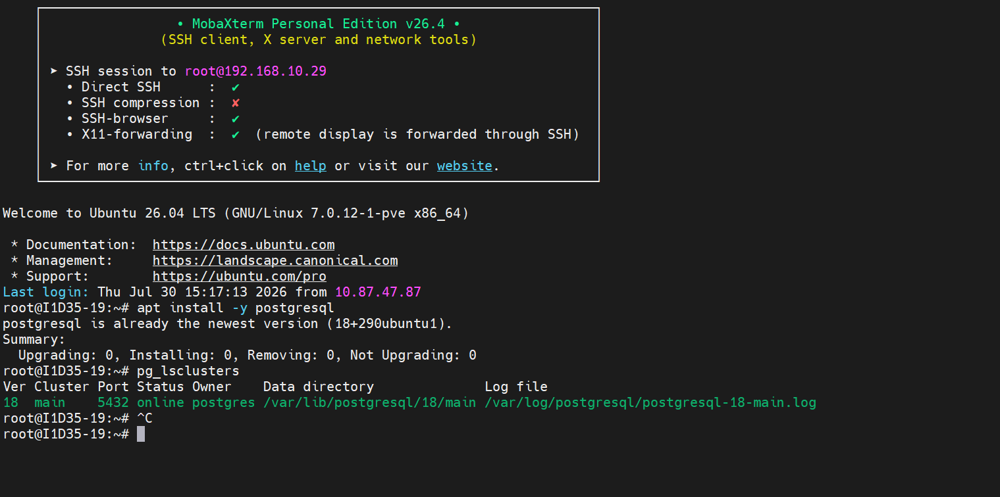
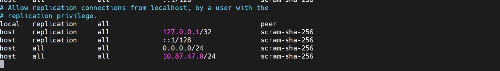
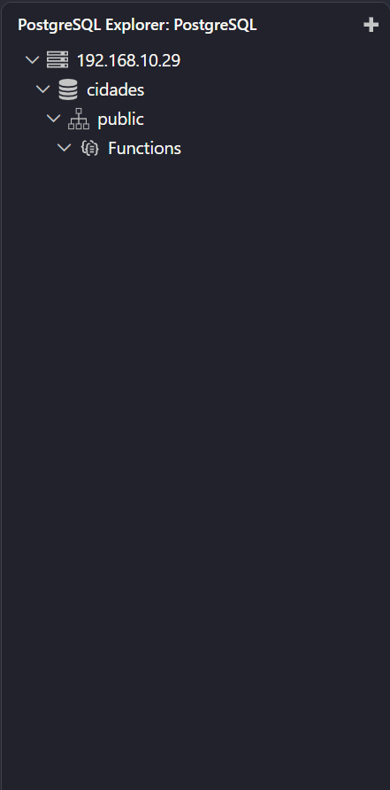
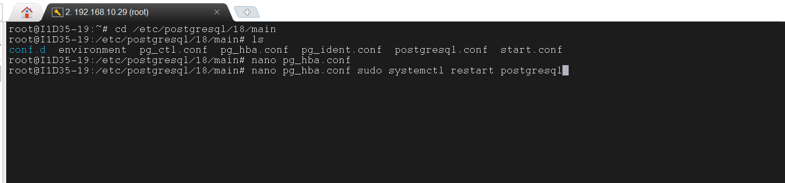

## Aula 02-06/08/2026
Para verificar o status e demais informações do banco de dados, utilizamso o comando:

````bash
pg_lsclusters
````



>lembrar do htop par a ver as informaçoes do computador 


para o acesso, via root sem senha (SOCKET LOCAL),utilizamos o comando:

````bash
sudo -u postgres psql
 ````
>com esse comando nao preciso mostrar quem o meu usuario é, o linux já faz a autenticação

retorna ao usuario anterior
 ````bash
\q ->  barra quit 
````
SQL --> maiusculo

Para alteração de senha do usuários Postgres, utilizamos o comando:
```sql
ALTER USER postgres PASSWORD 'Wolfgang'
```

Apos alteração da senha, o acesso via LOCAL HOST (SOCKET Externo)
, é feito através do comando:
 ```sql
sudo psql -h 127.0.0.1 -U postgres
```
### Configurações iniciais do POSTGRESS:
-para habilitar conexões externas, de outros IPs, foi necessário as seguintes etapas:

1. Navegar até a pasta de POSTGRESQL ('/etc/postgres/18/main/`).

2. Editar o arquivo `postgresql.conf` através do comando:

```bash
sudo nano postgresql.conf
```

3. Editar a linha listen_dresses = '*';

4. Editar o arquivo com a linha:

sudo nano pg_hba.conf

>hba é o posteiro do Banco de Dados

5. Nas últimas, linhas adicionamos as seguintes configurações:



**Crianção Banco de Dados**

````mermaid
graph TD
A[(Banco de Dados)]

````
  usamos o comando para entrar:
  sudo psql -h 127.0.0.1 -U postgres


  Para criar o banco de Dados , utilizamos o comando:
  
  ````sql
  CREATE DATABASE cidades;
  ````
  Para verificar os bancos existentes:

  ````sql
  \l
  ````
  > barra invertida L --> \l ( isso é um L nao o 1)

antes de vir ao VsCode, damos o comando:

clear sudo systemctl restart postgresql
 
 Após isso, baixamos postgresql nas extenções

 quando aparecer esse icone entrar nele:


clique no + para criar um novo, coloque as informaçoes como:
-ip da maquina
-usuario postgres
-senha 
-o port number
-standard Connection 

e por fim deve aparecer oque você crio e ao clicar deve ficar algo assim:



