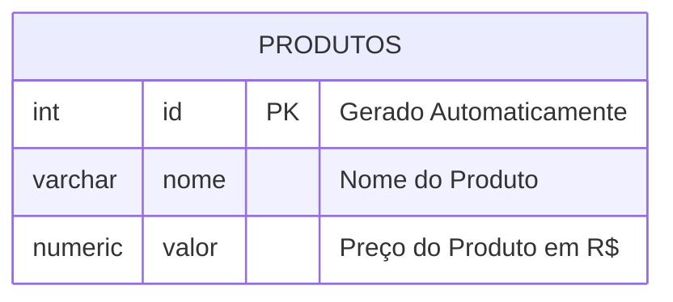
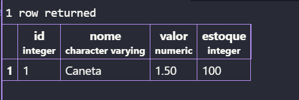

# Aula 03 - 13/08/2026
### Banco de Dados

Para apagar Banco de Dados, utilizamos o comando: 
````sql
DROP DATABASE nomedobanco
````

>não esquecer do ;

---

**Modelagem do Banco de Dados**




Após modelar,iremos executar as etapas de criação e inserção de dados. 
---

Para criar a primeira tabela usamos o comando:
````sql
CREATE TABLE produtos(
    id INT GENERATED ALWAYS AS IDENTITY PRIMARY KEY,
    nome VARCHAR(100) NOT NULL,
    valor NUMERIC(10,2) NOT NULL,
    estoque INT NOT NULL DEFAULT 0
);
````
Para consultar os elementos da Tabela usamos o comando :

```sql
SELECT * FROM produtos;
```


Para inserir os valores usamos o comando:
```sql
INSERT INTO podutos(nome,valor,estoque)
 VALUES('Caneta','1.50','100');
```
E Ficou assim o resultado;

