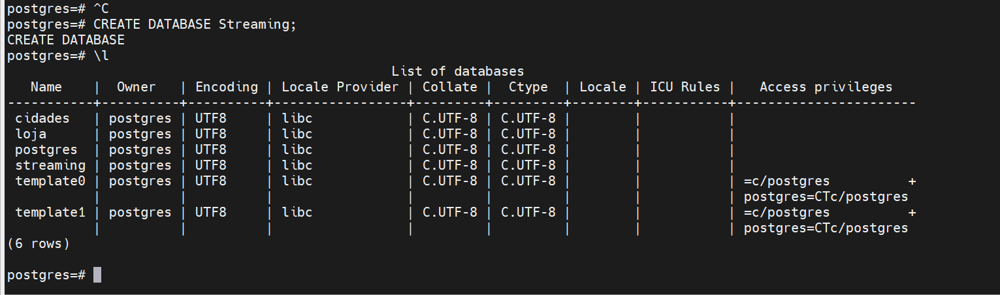
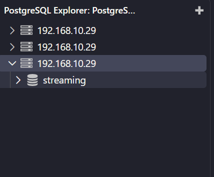
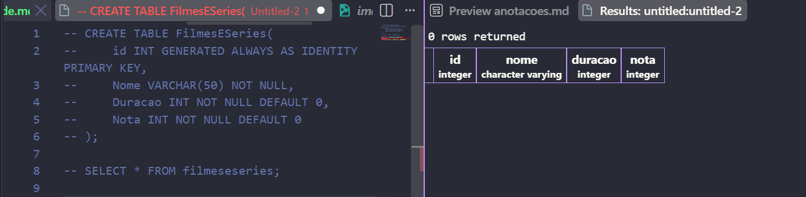
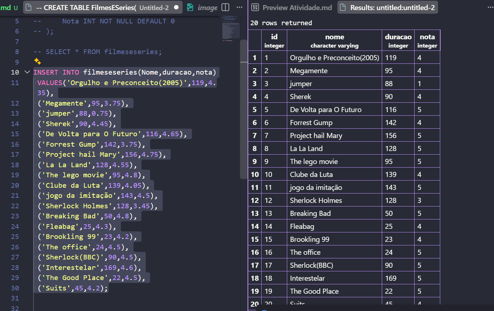
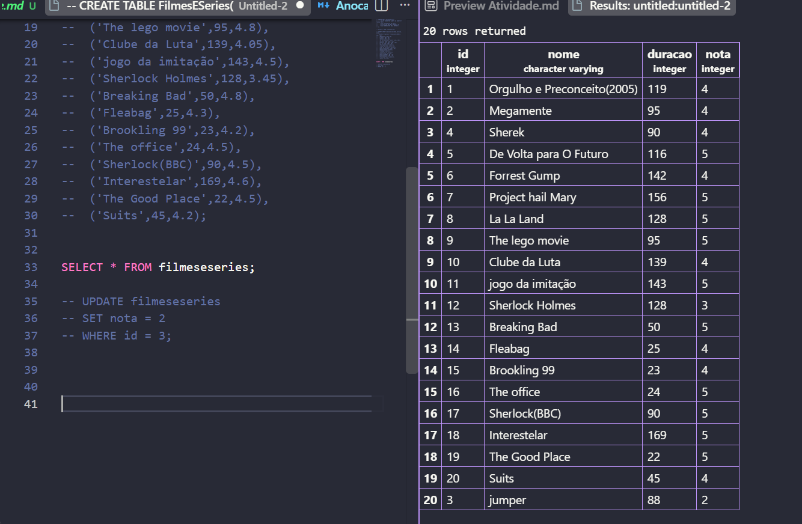
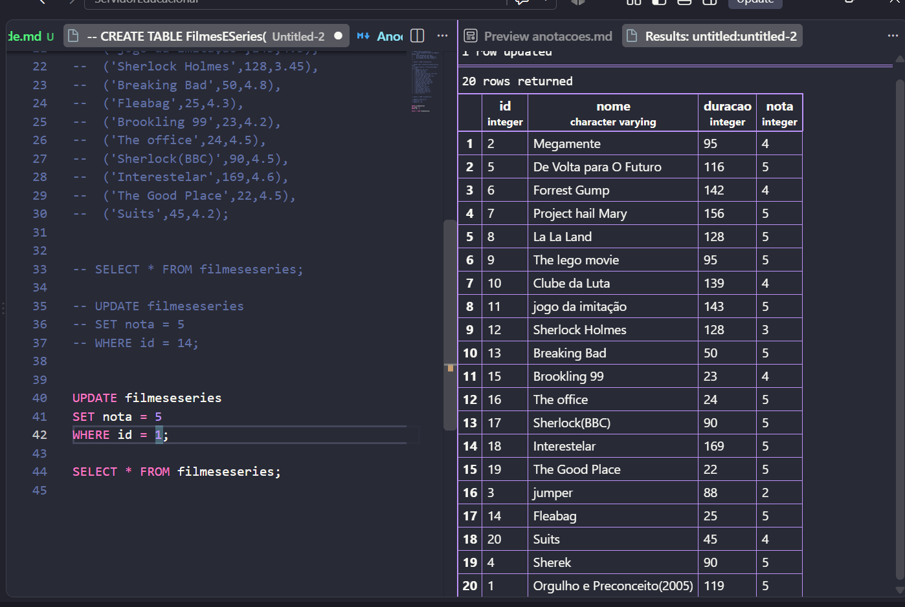
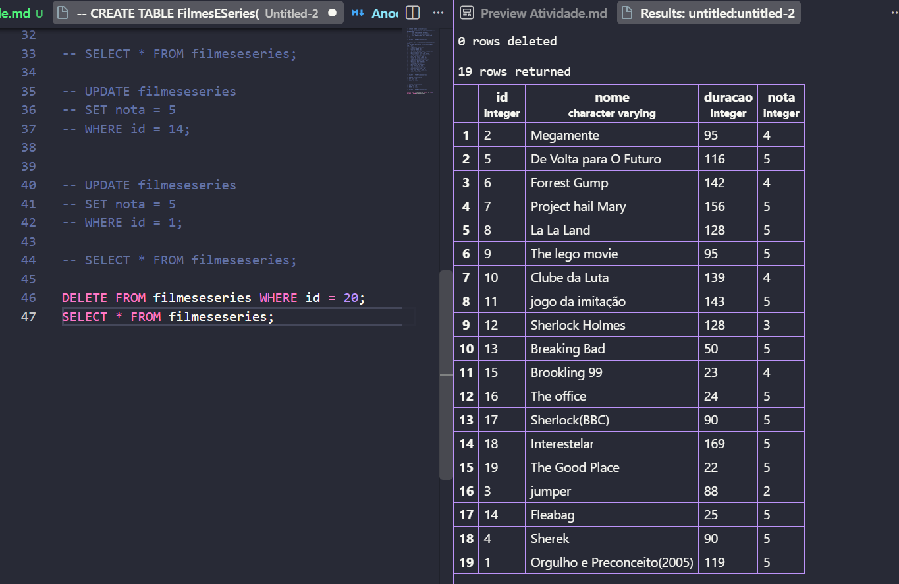
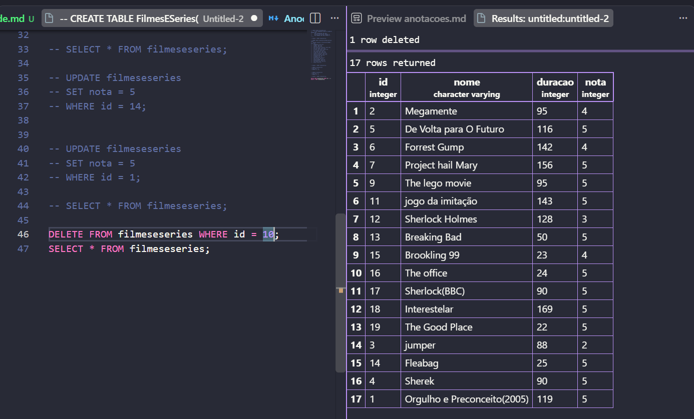
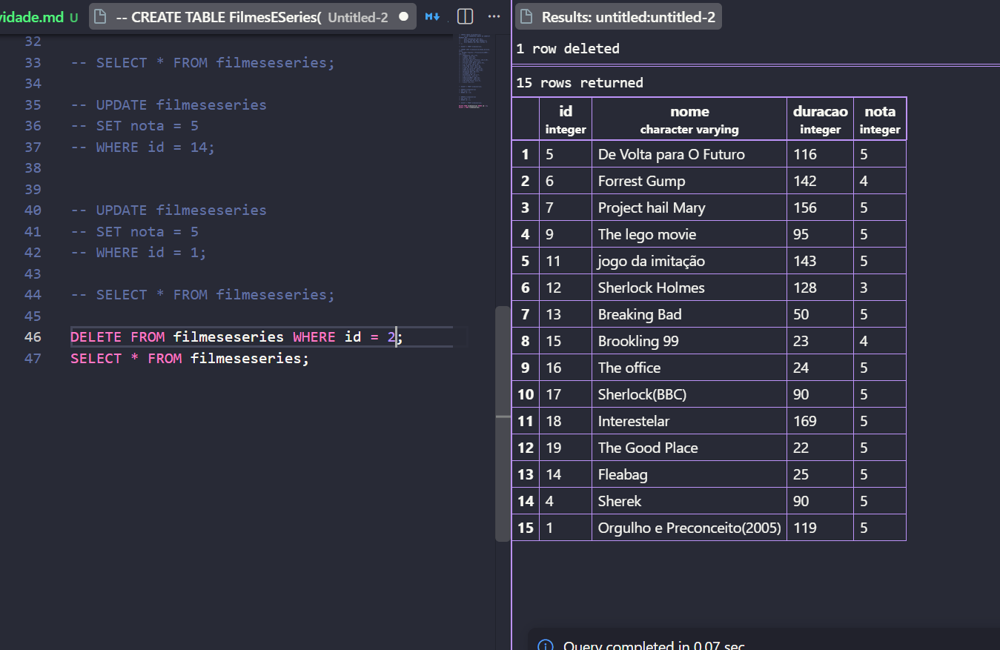

## Banco de Dados-Streaming
### atividade- 20/08/2026


O primeiro passo foi criar o Banco de Dados,
Utilizei o comando:


````sql
sudo psql -h 127.0.0.1 -U postgres
````
e o 
````sql
CREATE DATABASE Streaming;
````
E com o \l vemos que criou



Apos isso no VSCOde Adicionei um Banco de Dados:





E criei um TABLE de nome FilmesESeries com as tabelas:

```sql
INSERT INTO filmeseseries(Nome,duracao,nota)
 VALUES('Orgulho e Preconceito',119,4);
```



Adicionei os dados, entre eles Filmes e Series,



Atualizei a tabela com o Comando, mudando a nota de 5 filmes:
````sql
UPDATE filmeseseries
SET nota = 2
WHERE id = 3;
````



Aqui ja eu atualizei os 5 filmes que podem ser vistos em baixo de todos os outros.


E para finalizar  Deletei 5 filmes com o comando:

````sql
DELETE FROM filmeseseries WHERE id=10;
````





E no fim a tabela ficou com esta aparência:




No fim, por motivos esteticos Eu usei o comando:
````sql
SELECT * FROM filmeseseries
ORDER BY nota DESC;
````