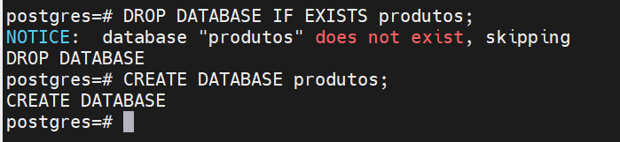
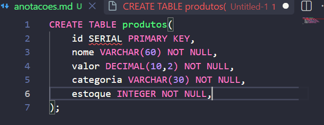
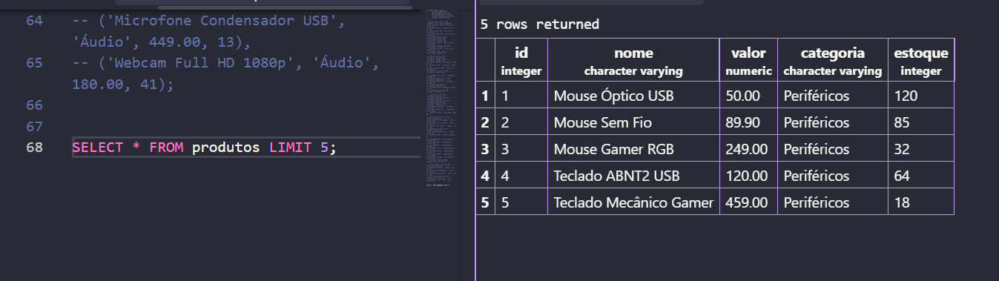
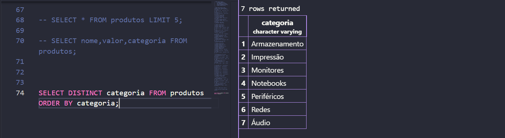
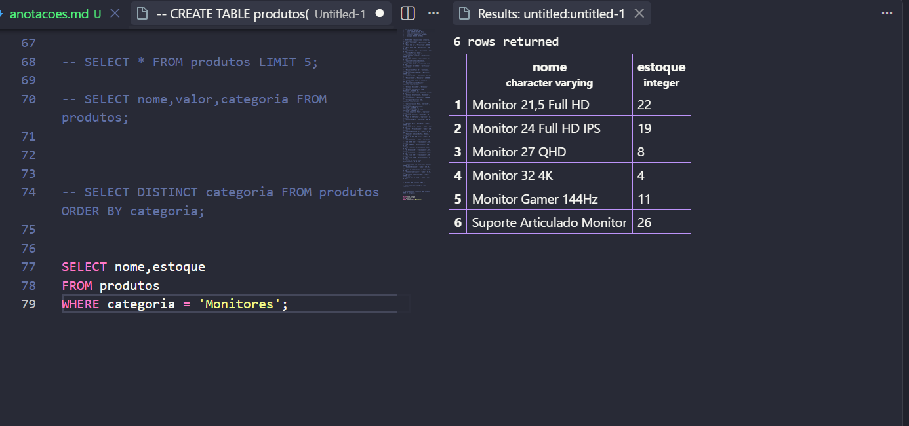
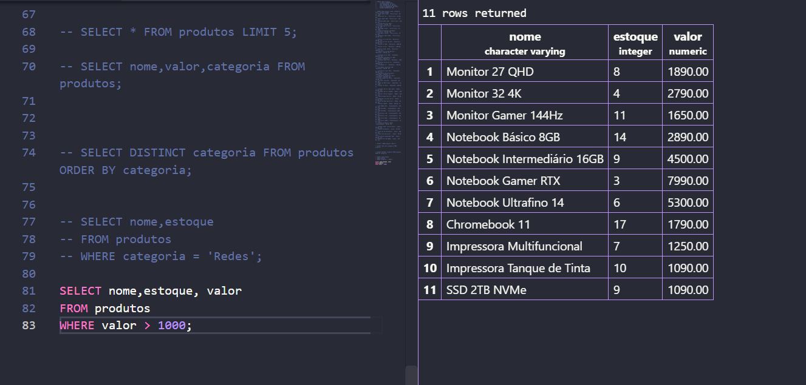
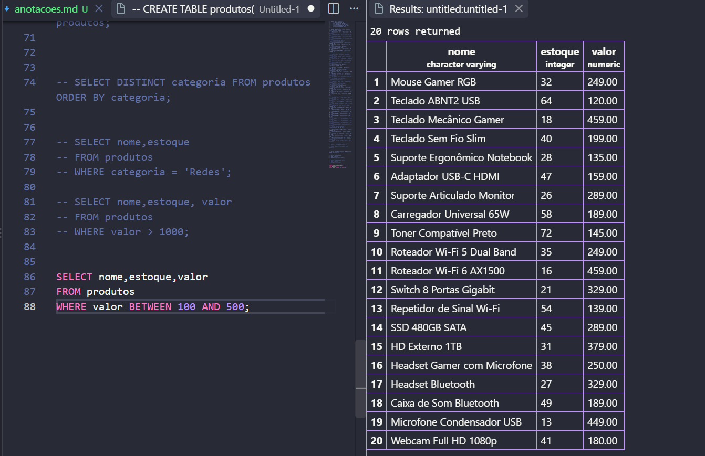
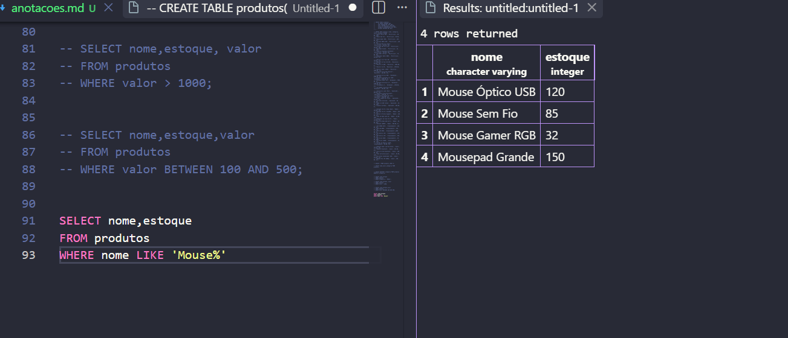

# Aula 05 - Comandos SQL Analize de Dados
### 25/08/2026

### Parte 1
Criação e inserção de Dados, realizando algumas consultas avançadas.


Utilizei esse comando para entrar no postgres





Criamos aqui


Em uma base de Dados muito grande é interessante filtrar os 5 primeiros, usando o LIMIT para limitar a quantidade.



para filtrar colunas:
````sql
SELECT nome,valor,categoria FROM produtos;

````

Para escolher apenas uma categoria é assim:



### Parte-2
Filtro de Dados.


Oque é um vetor?
na matematica é um segmento de reta que possuie modulo direção e sentido.
no banco de dados, cada Dados é um vetor, que possuie modo direção e sentido.





````sql
SELECT nome,estoque
FROM produtos
WHERE categoria = 'Redes';
````
Filtros de Valores mais caros:

````sql
SELECT nome,estoque, valor
FROM produtos
WHERE valor > 1000;
````




< > = aritimeticos
and = logicos
if,else = condicionais

Filtro entre faixas de valores:
````sql
SELECT nome,estoque,valor
FROM produtos
WHERE valor BETWEEN 100 AND 500;
````



Busca por trecho de texto,

````sql
SELECT nome,estoque 
FROM produtos
WHERE nome LIKE 'Mouse%'
````


>o porcentagem e o operador coringa:

O ILIKE
Desconsidera letras maiusculas:
````sql
SELECT nome,estoque 
FROM produtos
WHERE nome ILIKE 'Mouse%'
````


SELECT * FORM LIVROS LIMIT 10;