# Aula 05 BD - Atividade

## 📚 Sobre a atividade

Esta atividade foi realizada na aula 05 de Banco de Dados (BD), com o objetivo de praticar comandos SQL para criar e consultar um banco de dados.

Foi criado um banco de dados contendo uma tabela de **livros**, com informações como:

* Título
* Autor
* Gênero
* Preço
* Estoque
* Ano de publicação

## 🗄️ Criação do Banco de Dados

Primeiramente, foi criado o banco de dados para armazenar as informações dos livros.

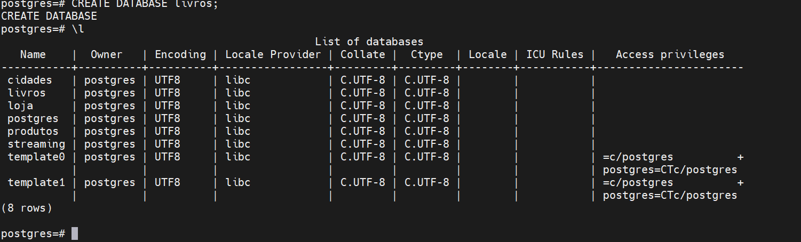

Depois, foi criada a tabela responsável por guardar os dados dos livros.

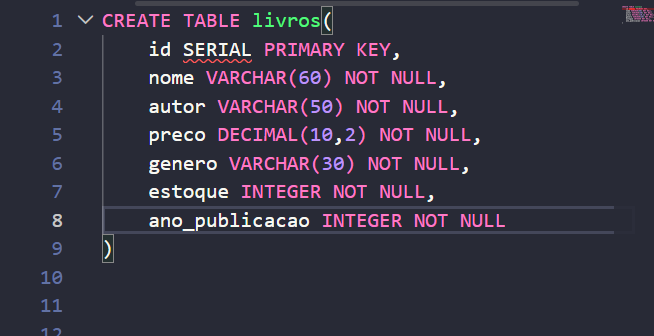
Os registros foram inseridos na tabela para que fosse possível realizar as consultas propostas na atividade.

##  Bloco 1 — Reconhecimento da base

Nesta parte foram realizadas consultas para conhecer melhor os dados armazenados.

Foram feitas consultas para:

1. Exibir os 10 primeiros registros.
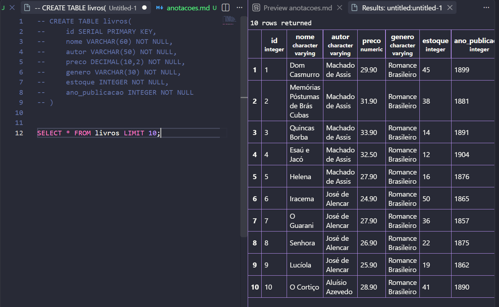
2. Exibir somente título, autor e preço.
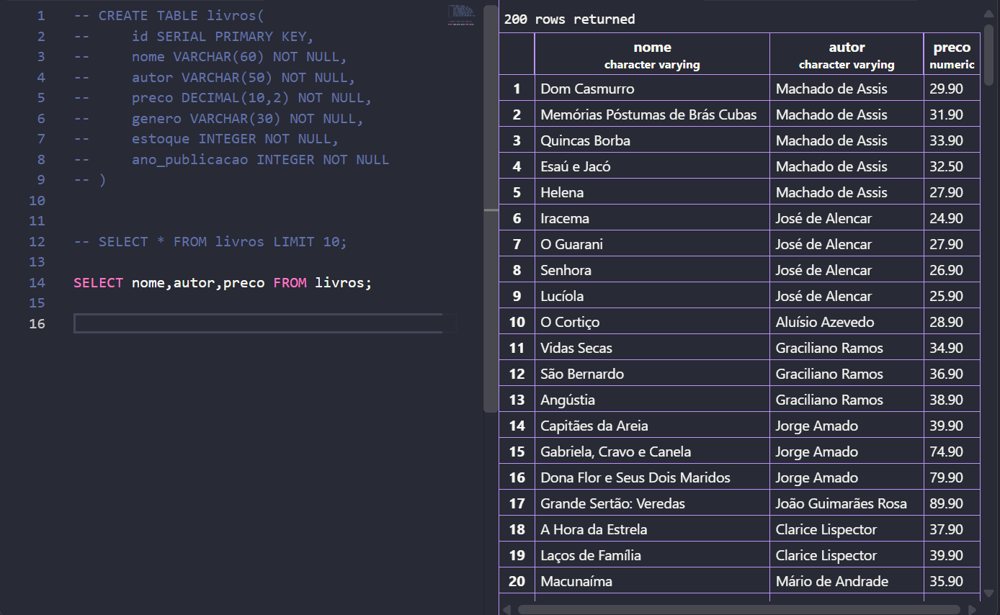
3. Listar os gêneros diferentes em ordem alfabética.
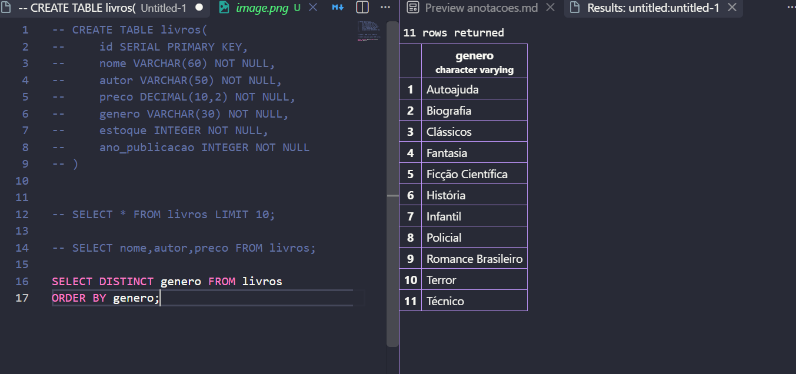
4. Descobrir a quantidade de autores diferentes.
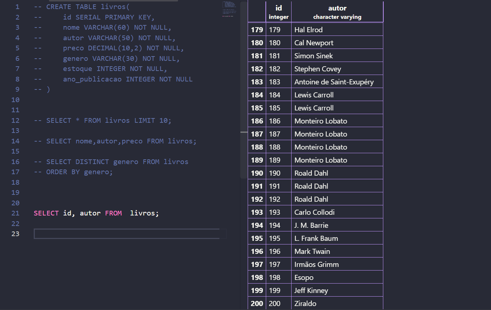
5. Encontrar os 5 livros mais caros.
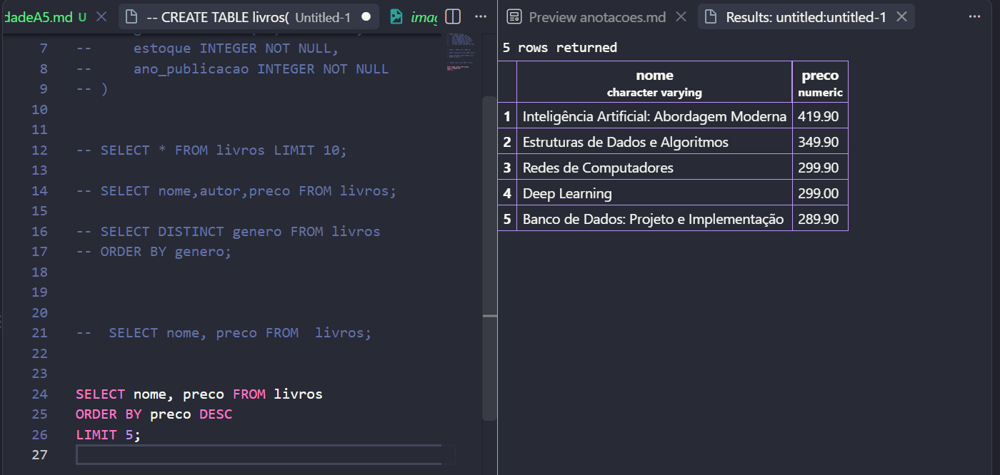
6. Encontrar os 5 livros com menor estoque.
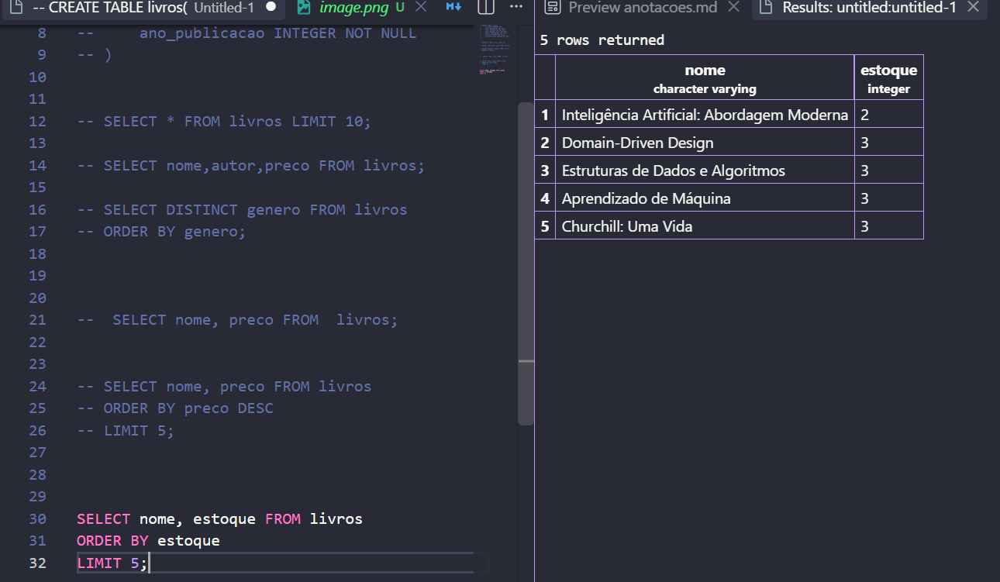

##  Bloco 2 — Filtros numéricos

Nesta etapa foram utilizados filtros para encontrar livros de acordo com determinadas condições.

Foram realizadas consultas para:

7. Mostrar livros do gênero **Técnico** e seus estoques.
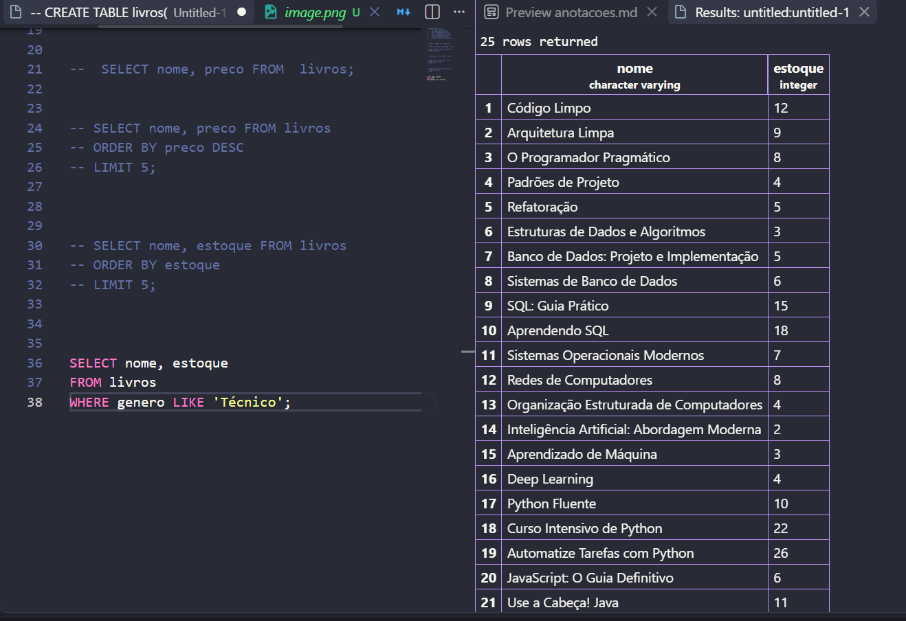
8. Mostrar livros com preço acima de **R$ 200,00**.
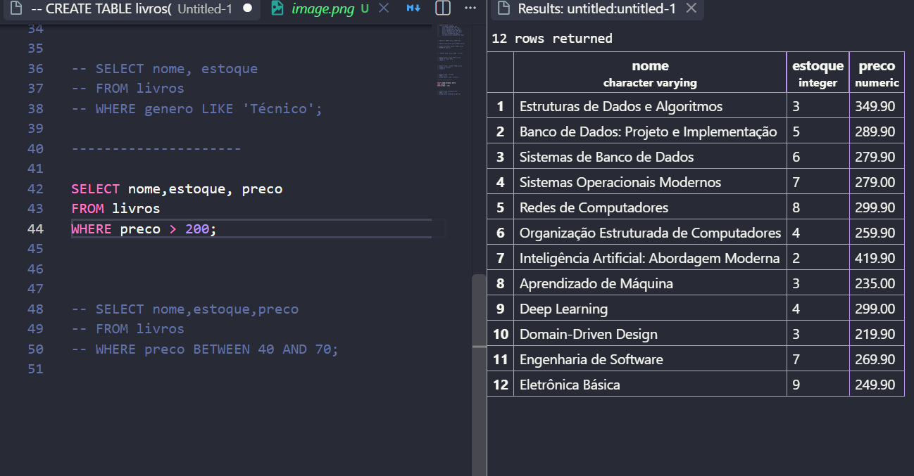
9. Mostrar livros com preço entre **R$ 40,00 e R$ 70,00**.
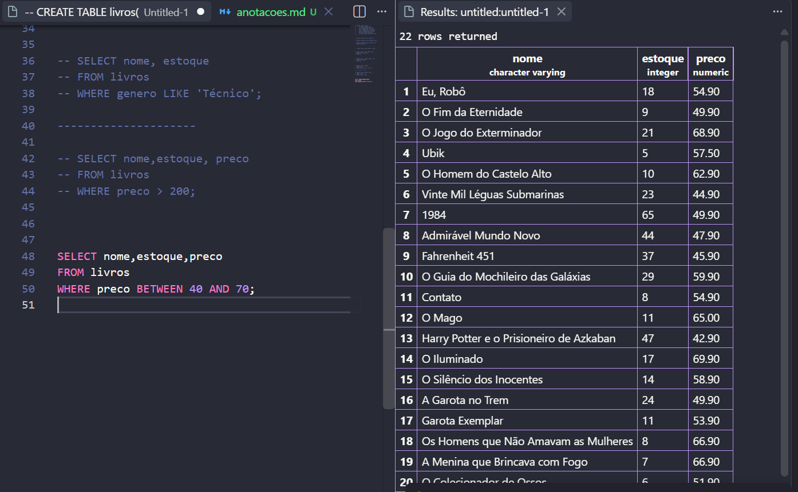
10. Encontrar livros com estoque abaixo de **5 unidades**.
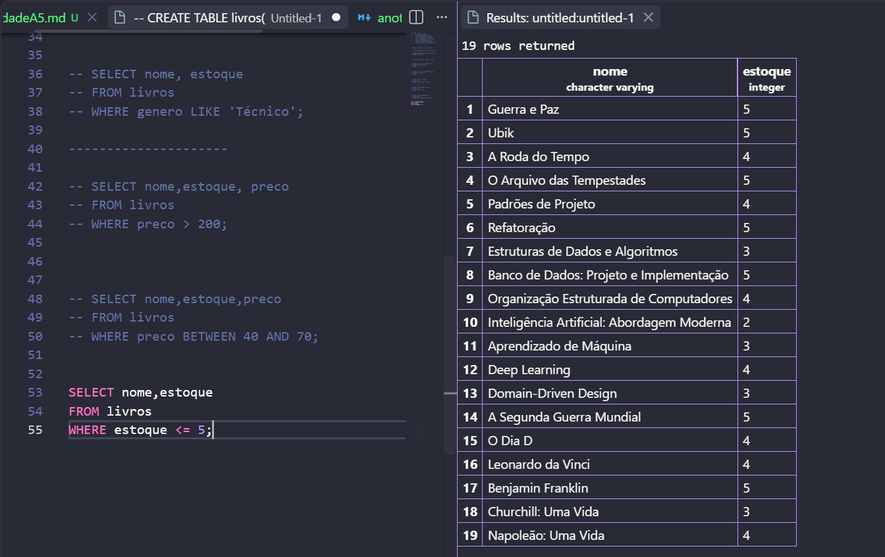
11. Listar livros publicados antes de **1900**, do mais antigo para o mais recente.
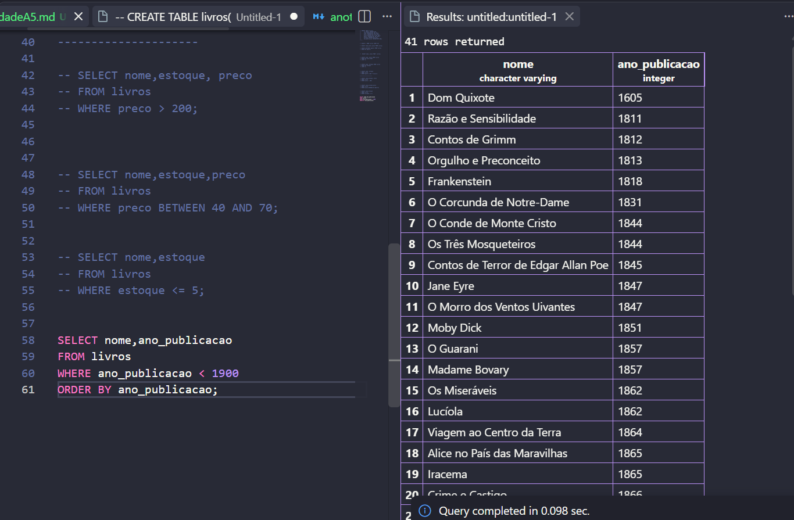
12. Listar livros publicados entre **2010 e 2020**, mostrando título, ano e gênero.
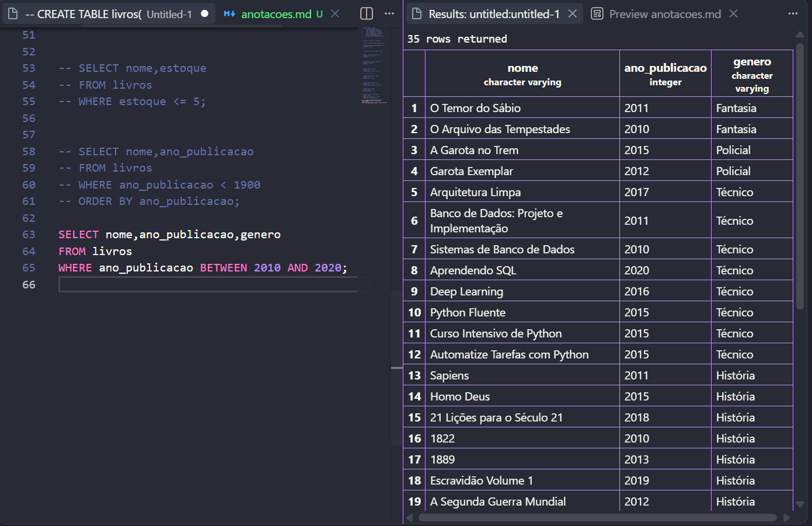

## 💻 Comandos SQL praticados

Durante a atividade foram praticados principalmente comandos e recursos como:

* `SELECT`
* `DISTINCT`
* `COUNT`
* `WHERE`
* `ORDER BY`
* `LIMIT`
* `BETWEEN`
* Operadores de comparação, como `>`, `<` e `=`

## 🎯 Objetivo

O objetivo da atividade foi aprender a realizar consultas em um banco de dados utilizando SQL, aplicando filtros, ordenação, limites e funções para encontrar informações específicas dentro da tabela de livros.

## 📌 Conclusão

A atividade ajudou a praticar os conceitos básicos de **Banco de Dados e SQL**, permitindo criar uma base, inserir informações e realizar diferentes tipos de consultas sobre os dados armazenados.
