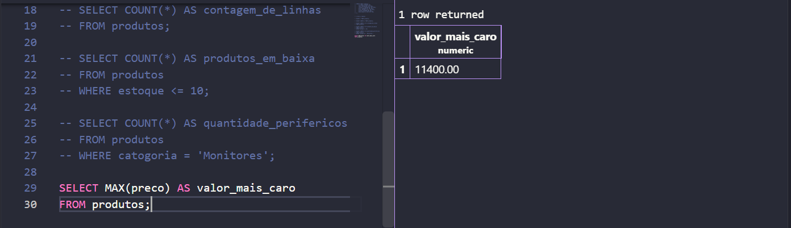
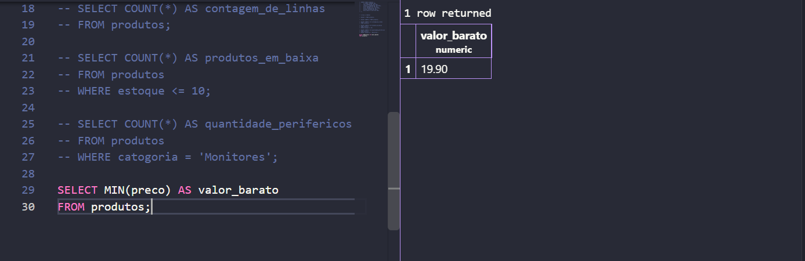
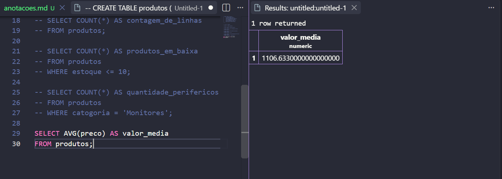
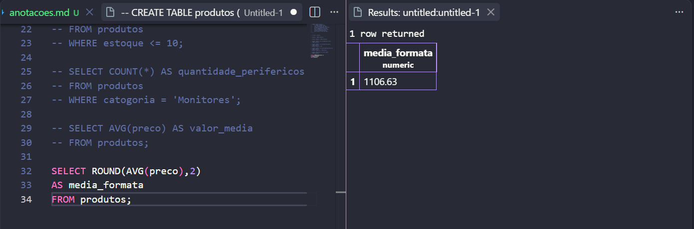
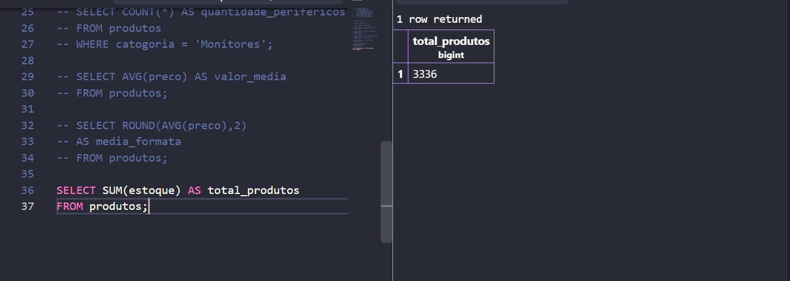
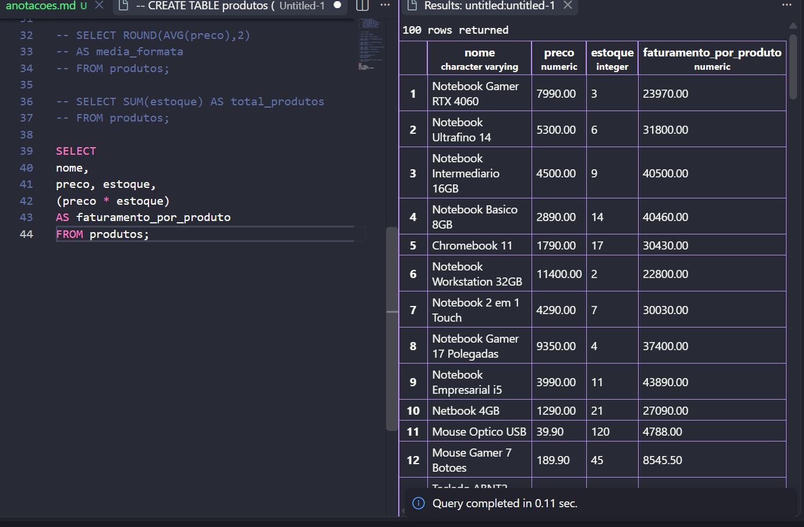
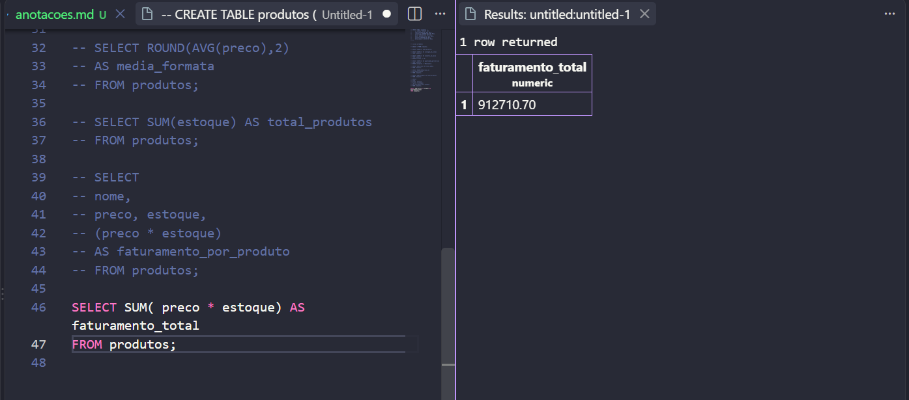

### Anotações aula 06 ou 07, nao temos certe


Primeiro criamos a tabela

````sql
CREATE TABLE produtos (
    id SERIAL PRIMARY KEY,
    nome VARCHAR(60) NOT NULL,
    catogoria VARCHAR(30) NOT NULL,
    marca VARCHAR(30) NOT NULL,
    preco DECIMAL(10,2) NOT NULL,
    estoque INTEGER NOT NULL,
    data_cadastro DATE NOT NULL
);
````
>  DATE -> é pra data e time stamp

inserimos as informaçoes


para ter a dimenção do tamanho da base de dados, utilizamos esse comando:
````sql
SELECT COUNT(*) AS contagem_de_linhas 
FROM produtos;
````

Para filtrar produtos utilizamos :

````sql
SELECT COUNT(*) AS produtos_em_baixa
FROM produtos
WHERE estoque <= 10;
````

para usar o filtro :

````sql
SELECT COUNT(*) AS quantidade_perifericos
FROM produtos
WHERE catogoria = 'Monitores';
````

oque é uma função?
- Conjunto de indtruções pre-definidas.
- Vai fazer sempre.


Seleciona os produtos mais caros

````sql
SELECT MAX(preco) AS valor_mais_caro
FROM produtos;
````


Seleciona os produtos mais baratos 

````sql
SELECT MIN(preco) AS valor_barato
FROM produtos;
````



Faz a media do preco dos produtos

````sql
SELECT AVG(preco) AS valor_media
FROM produtos;
````



para formatar numeros
````sql
SELECT ROUND(AVG(preco),2)
AS media_formata 
FROM produtos;
````




para somar os valores dos produtos
````sql
SELECT SUM(estoque) AS total_produtos
FROM produtos;
````



para descobrir o faturamento

````sql
SELECT 
nome,
preco, estoque,
(preco * estoque)
AS faturamento_por_produto
FROM produtos;
````



para descibrir o faturamento total, apenas somamos as linhas de faturamento de produto.

````sql
SELECT SUM( preco * estoque) AS faturamento_total 
FROM produtos;
````




>Tem que fazer os cursos.

